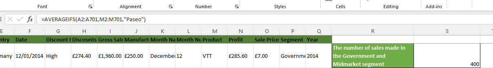

# Sales-Datasets-2
This repository contains a comprehensive sales dataset which include product details, revenue, profit, discount, segment, year. The business questions to solve using the sales data include the following:
Calculate:
-The average revenue generated from each sale of ‘Paseo’
-The number of sales made in the Government and Midmarket segment
-The total revenue generated from the sales of ‘Montana’ in Canada
-In which Country, Segment and Month was the highest unit of goods sold?
-What is the total profit made in December?

**The average revenue generated from each sale of ‘Paseo’.**

Based on the calculated average revenue generated from each sale of 'Paseo,' which is approximately £163,621.50. We can draw insight that the average revenue of £163,621.50 indicates that, on average, each sale of the 'Paseo' product contributes this amount to the company's total revenue. This is a substantial figure and suggests that the 'Paseo' product is a significant revenue driver for the business.

**The number of sales made in the Government and Midmarket segment**

In the Government and Midmarket segments, a total of 400 sales were made. This suggests that these segments are significant contributors to the company's revenue. Further analysis is needed to understand the specific factors driving sales in these segments and to optimize strategies accordingly.

**The total revenue generated from the sales of ‘Montana’ in Canada**

The analysis revealed that the 'Montana' product line generated a total revenue of £2,711,919.03 in Canada. This insight highlights the specific product's performance in a particular region, indicating strong sales potential. It suggests opportunities for further marketing and investment in the 'Montana' product within the Canadian market to capitalize on its success and potentially replicate this success in other regions.

**In which Country, Segment and Month was the highest unit of goods sold?**

In the analysis, it was discovered that the highest number of units of goods sold, amounting to £4,492.50, occurred in the United States of America. This finding underscores the significant demand for the products in the U.S., highlighting it as a lucrative market. By understanding the key segment and month associated with this remarkable unit sales figure, we can refine the marketing and sales strategies, and delivery for even greater success. This insight directs our focus to meet consumer needs effectively and maximize profitability, strengthening the presence in the U.S. market.

Further data analysis revealed a noteworthy insight—the highest unit of goods sold occurred in April. However, to fully comprehend this peak, we delved deeper to identify the specific segment. 

Upon analyzing the data, it was determined that the Government segment recorded the highest unit of goods sold. This finding is crucial for understanding sales performance, as it indicates that the Government segment is a significant driver of product sales. This detailed understanding will enable the team to target and tailor strategies to optimize sales and capitalize on the Government segment's success.

**What is the total profit made in December?**

In the analysis, it was discovered that December yielded a substantial total profit of £2,717,329.98, despite April being the month with the highest profit. This insight is noteworthy because it demonstrates the potential for seasonality in the business. While April may be the peak-profit month, December's strong performance suggests an opportunity to capitalize on the holiday season and end-of-year trends. By harnessing the December momentum, we can develop targeted strategies to boost profitability even further during this period.

**END**

# Medical-Datasets

